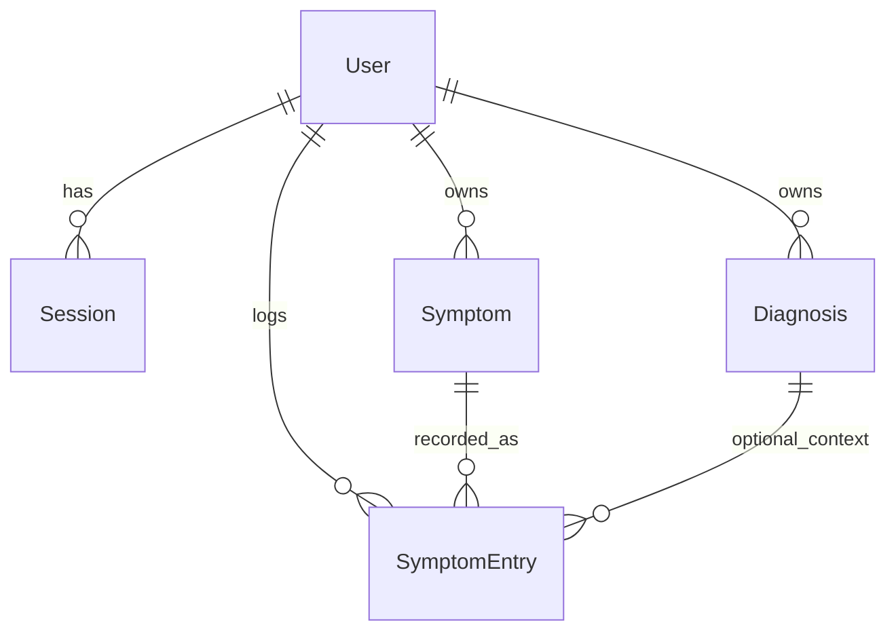

# Symptom Tracker — Implementation Plan

> **Repo copy** for your records. Synced from the Cursor plan (`symptom_tracker_mvp_2c7891ce`).  
> When scope changes, update this file (and ask the agent to refresh the Cursor plan if you use both).

## Progress tracker (user stories)

| ID | Story | Status |
|----|-------|--------|
| US-01 | Sign up | pending |
| US-02 | Sign in / sign out | pending |
| US-03 | Timezone on user | pending |
| US-04 | Manage symptom catalog | pending |
| US-05 | Manage diagnoses | pending |
| US-06 | Log symptom episode | pending |
| US-07 | Edit/delete entries | pending |
| US-08 | Dashboard + quick-log | pending |
| US-09 | Export CSV | pending |
| US-10 | PWA for phone | pending |
| US-11 | Tests per story | pending |

---

## How we will work together

You implement most of the code; this document is the **source of truth** for scope and order. Use the agent when you want:

- A **walkthrough** before starting a user story (“what files will I touch?”)
- **Review** of a PR-sized chunk (“does this scoping look right?”)
- **Unblocking** on errors, tests, or Rails 8 auth quirks
- **Plan updates** when you change direction (new story, defer a feature)

Suggested rhythm per user story:

1. Read the story + acceptance criteria below.
2. Implement on a branch (one story or a small group).
3. Check off acceptance criteria yourself.
4. Ask the agent to review or help with tests before moving on.

Do **not** need the agent to write every line — the **Tasks (you)** sections are your checklist.

---

## Trello board

| | |
|--|--|
| **Board** | [symptom_tracker](https://trello.com/b/kBPlSnnx/symptomtracker) |
| **Board ID** | `6a13ec365fc1135ec15355b2` |

**Lists (left → right):**

| List | Cards |
|------|--------|
| Epic A — Account and access | US-01, US-02, US-03 (+ MVP total estimate summary) |
| Epic B — Personal catalogs | US-04, US-05 |
| Epic C — Logging episodes | US-06, US-07 |
| Epic D — Dashboard | US-08 |
| Epic E — Export | US-09 |
| Epic F — PWA | US-10 |
| Epic G — Tests | US-11 |
| Backlog (post-MVP) | Deferred features (no hour estimates) |
| Done | Move cards here when a story ships |

**Sync rules**

- **Canonical acceptance criteria:** this file (`docs/PLAN.md`) and Trello card checklists (should match).
- **Time estimates:** shown on Trello card titles, e.g. `US-04 — Manage symptom catalog (4h)`. MVP total ~**37h** (mid-level Rails dev).
- **When you finish a story:** check off AC here, check off Trello checklist items, move the card to **Done**.

---

## Starting point

`ruby_symptom_tracker` is a **fresh Rails 8.1** app (PostgreSQL, Hotwire/Turbo/Stimulus, Kamal/Docker). No domain models or app routes yet.

Confirmed scope:

- Episode logging over time
- Multi-user: all data scoped to `current_user`

---

## Domain model (reference)



**Scoping:** `current_user.symptoms`, `.diagnoses`, `.symptom_entries` — never `Symptom.find(params[:id])` without ownership check.

**Duplicates:** `validates :name, uniqueness: { scope: :user_id, case_sensitive: false }` on `Symptom` and `Diagnosis`; strip whitespace before validation.

---

## Routes (target)

```ruby
root "dashboard#show"
resource :session, only: %i[new create destroy]
resources :users, only: %i[new create]
resources :symptoms, except: :show
resources :diagnoses, except: :show
resources :symptom_entries
get "export", to: "exports#show"
# PWA: manifest + service_worker (uncomment in config/routes.rb)
```

---

# User stories (implementation order)

Stories are ordered by dependency. Later stories assume earlier ones are done.

---

## Epic A — Account and access

### US-01 — Sign up

**As a** visitor  
**I want to** create an account with email and password  
**So that** my health data is stored privately under my own login

**Acceptance criteria**

- [ ] `bcrypt` enabled in `Gemfile`
- [ ] `bin/rails generate authentication` run; `db:migrate` succeeds
- [ ] `/users/new` + `POST /users` creates a `User` with `has_secure_password`
- [ ] Invalid email/password shows errors (no silent failure)
- [ ] After sign-up, user is signed in (session created) or redirected to sign-in with clear message

**Tasks (you)**

1. Uncomment `gem "bcrypt"` and `bundle install`
2. Run authentication generator; review generated `User`, `Session`, `Authentication` concern
3. Wire `resources :users, only: %i[new create]` and views (generator may provide these)
4. `bin/rails db:create db:migrate`

**Hints**

- Rails 8 auth uses `email_address` (not `email`) on `User` — match generator attribute names
- `config/routes.rb` has no root yet; US-02 sets it

**Agent can help with:** generator output explanation, strong params, test setup for `User`

---

### US-02 — Sign in and sign out

**As a** registered user  
**I want to** sign in and sign out  
**So that** only I can access my tracker

**Acceptance criteria**

- [ ] `GET/POST /session/new` signs in with correct credentials
- [ ] Wrong password shows error, does not sign in
- [ ] `DELETE /session` signs out
- [ ] `before_action :require_authentication` on app controllers (except session + user signup)
- [ ] Unauthenticated visit to `/` redirects to sign-in
- [ ] `root` → `dashboard#show` (dashboard can be placeholder empty state)

**Tasks (you)**

1. Confirm `SessionsController` and `Authentication` concern from generator
2. Add `DashboardController#show` with minimal view (“Welcome” / empty state)
3. Set `root "dashboard#show"` in routes
4. Add nav partial: sign out link when logged in

**Hints**

- Generator typically adds `Current.session` / `Current.user` pattern — use it consistently

**Agent can help with:** where to skip `require_authentication`, layout nav patterns

---

### US-03 — Timezone on user

**As a** user  
**I want** dates and “today” to match my local timezone  
**So that** logs and exports align with how I experience symptoms

**Acceptance criteria**

- [ ] `users.time_zone` column (string, default `"UTC"`)
- [ ] User can set timezone (signup form, profile edit, or sensible default from browser later)
- [ ] `Time.zone` set from `current_user.time_zone` in `ApplicationController` (or concern) for each request

**Tasks (you)**

1. Migration: `add_column :users, :time_zone, :string, default: "UTC", null: false`
2. Permit `time_zone` in user params; dropdown or text field (`ActiveSupport::TimeZone.all`)
3. `around_action` or `before_action` to set `Time.zone`

**Depends on:** US-01

**Agent can help with:** `around_action :use_timezone` snippet, test with `travel_to`

---

## Epic B — Personal catalogs

### US-04 — Manage symptom catalog

**As a** signed-in user  
**I want to** add, list, edit, and delete my symptom names  
**So that** I can log episodes using a consistent vocabulary

**Acceptance criteria**

- [ ] `Symptom` belongs to `user`; `name` required
- [ ] Duplicate name for same user rejected (case-insensitive): “Fatigue” vs “fatigue”
- [ ] Another user may use the same name (different `user_id`)
- [ ] Index shows my symptoms only; create/edit/delete work with Turbo-friendly forms
- [ ] Cannot access another user’s symptom via URL tampering (`params[:id]` scoped to `current_user.symptoms`)

**Tasks (you)**

1. `rails g model Symptom user:references name:string`
2. Add uniqueness validation + `before_validation` strip on `name`
3. `SymptomsController` + views (`index`, `new`, `create`, `edit`, `update`, `destroy`)
4. Link from nav or dashboard to Symptoms

**Depends on:** US-02

**Model sketch**

```ruby
class Symptom < ApplicationRecord
  belongs_to :user
  has_many :symptom_entries, dependent: :restrict_with_error # or :destroy if US-07 allows
  validates :name, presence: true,
    uniqueness: { scope: :user_id, case_sensitive: false }
  before_validation { self.name = name&.strip }
end
```

**Agent can help with:** `restrict_with_error` vs `destroy`, system test for duplicate

---

### US-05 — Manage diagnoses

**As a** signed-in user  
**I want to** record my chronic illness diagnoses  
**So that** I can associate symptom episodes with a condition

**Acceptance criteria**

- [ ] `Diagnosis` belongs to `user`; `name` required; duplicate names blocked (same rules as symptoms)
- [ ] Optional `diagnosed_on` (date) and `notes` (text)
- [ ] Full CRUD UI, scoped to `current_user.diagnoses`
- [ ] Nav or dashboard link to Diagnoses

**Tasks (you)**

1. `rails g model Diagnosis user:references name:string diagnosed_on:date notes:text`
2. Mirror US-04 controller/view patterns for consistency
3. Add `has_many :diagnoses` on `User`

**Depends on:** US-02 (parallel with US-04 after patterns established)

**Agent can help with:** reusing partials between symptoms and diagnoses

---

## Epic C — Logging episodes

### US-06 — Log a symptom episode

**As a** signed-in user  
**I want to** record when a symptom happened, how severe it was, and optional notes  
**So that** I can track patterns over time

**Acceptance criteria**

- [ ] `SymptomEntry` belongs to `user`, `symptom`; optional `diagnosis`
- [ ] Required: `symptom_id`, `occurred_at`, `severity` (e.g. integer 0–10)
- [ ] Optional: `ended_at`, `notes`, `diagnosis_id`
- [ ] Cannot attach another user’s `symptom` or `diagnosis` (validation or scoped find)
- [ ] `new`/`create` flows work from entries index and (later) dashboard quick-log

**Tasks (you)**

1. `rails g model SymptomEntry user:references symptom:references diagnosis:references occurred_at:datetime ended_at:datetime severity:integer notes:text`
2. Model validations: presence, severity numericality, custom validate ownership of associations
3. `SymptomEntriesController` — at minimum `index`, `new`, `create`
4. Form: symptom select (my symptoms), diagnosis select (optional), datetime-local, severity, notes

**Depends on:** US-04 (US-05 optional but diagnosis select needs US-05)

**Agent can help with:** `validate :symptom_belongs_to_user`, datetime form helpers

---

### US-07 — Edit and delete my entries

**As a** signed-in user  
**I want to** correct or remove logged episodes  
**So that** my history stays accurate

**Acceptance criteria**

- [ ] `edit`, `update`, `destroy` on `SymptomEntriesController`
- [ ] Index lists entries newest first (default scope or `order(occurred_at: :desc)`)
- [ ] Scoping: only my entries; 404 or redirect if id belongs to another user
- [ ] Deleting a symptom with entries: defined behavior (block delete or cascade — document your choice in README)

**Tasks (you)**

1. Add edit/update/destroy actions and views
2. Decide `dependent:` on `Symptom` / `Diagnosis` and document in plan or README
3. Add edit/delete links on index (and dashboard when US-08 done)

**Depends on:** US-06

---

## Epic D — Dashboard and insights (MVP-light)

### US-08 — Dashboard home

**As a** signed-in user  
**I want** a home screen with recent logs and a quick way to log a symptom  
**So that** daily tracking is fast

**Acceptance criteria**

- [ ] Root dashboard shows last N entries (e.g. 10)
- [ ] Quick-log form: pick symptom, severity, `occurred_at` (default now), optional diagnosis/notes → creates entry
- [ ] Simple stats: count per symptom for last 7 and/or 30 days (can be a small table, no chart required)
- [ ] Empty states when no symptoms or no entries (links to add symptom / log first entry)

**Tasks (you)**

1. Flesh out `DashboardController#show` — queries via `current_user.symptom_entries.includes(:symptom, :diagnosis)`
2. Partial `_quick_log_form` posting to `symptom_entries#create`
3. Optional `group(:symptom_id).count` with date filter

**Depends on:** US-04, US-06 (US-05 if diagnosis in quick-log)

**Agent can help with:** query performance, Turbo Frame for quick-log without full page reload

---

## Epic E — Share data with doctors

### US-09 — Export CSV

**As a** signed-in user  
**I want to** download my symptom history for a date range as CSV  
**So that** I can share accurate data with my doctors

**Acceptance criteria**

- [ ] `GET /export` with `start_date` and `end_date` params
- [ ] CSV columns: date/time, symptom name, severity, diagnosis name (if any), notes
- [ ] Only `current_user` entries in range; times respect user timezone
- [ ] Invalid/missing dates handled gracefully
- [ ] Filename includes date range (e.g. `symptoms_2026-01-01_2026-01-31.csv`)

**Tasks (you)**

1. `ExportsController#show` — `respond_to` format csv or dedicated CSV renderer
2. View with date fields + submit
3. Use `send_data` or `CSV.generate`

**Depends on:** US-06, US-03 (timezone)

**Agent can help with:** `send_data` headers, streaming for large exports (defer if small data)

---

## Epic F — Mobile use

### US-10 — PWA for phone

**As a** signed-in user  
**I want to** open the app from my phone home screen  
**So that** I can log symptoms quickly on the go

**Acceptance criteria**

- [ ] PWA routes enabled in `config/routes.rb` (manifest + service worker)
- [ ] Layout includes manifest link (see comments in `app/views/layouts/application.html.erb`)
- [ ] `app/views/pwa/manifest.json.erb` names app “Ruby Symptom Tracker”
- [ ] Forms usable on narrow viewport (touch-friendly buttons — CSS tweak)

**Tasks (you)**

1. Uncomment `pwa_manifest` and `pwa_service_worker` routes
2. Adjust manifest icons/start_url if needed
3. Smoke-test “Add to Home Screen” in mobile Safari/Chrome

**Depends on:** US-02 (need a usable logged-in UI)

**Agent can help with:** PWA checklist, minimal service worker behavior

---

## Epic G — Confidence

### US-11 — Tests per story

**As a** developer  
**I want** automated tests for critical paths  
**So that** refactors do not break privacy or duplicate rules

**Acceptance criteria**

- [ ] Model tests: symptom/diagnosis duplicate names; entry cannot use another user’s symptom
- [ ] System test: sign up → add symptom → log entry → see on dashboard (or index)
- [ ] `bin/rails test` and CI green

**Tasks (you)**

- Add tests **incrementally** as you finish US-04–US-08 (do not leave all testing to the end)
- Suggested mapping:
  - US-01/02: session/user test or system sign-in
  - US-04/05: model uniqueness + scoped controller test
  - US-06/07: model association ownership + system log flow
  - US-09: controller/export unit test with fixtures

**Depends on:** respective stories

**Agent can help with:** fixture design, system test selectors, CI failure logs

---

# Deferred (post-MVP)

- Charts (weekly frequency, severity trends)
- Triggers/tags, medications, flare flag
- Entry date-range filter on index
- OAuth / shared doctor access

---

# Reference — recommended features (why)

| Feature | Why it matters for your goal |
|---------|------------------------------|
| Episodes + severity + time | Pattern detection needs time series |
| Diagnosis on entry | Separate which illness a flare belongs to |
| Dashboard + quick-log | Low friction → more complete data |
| CSV export | Doctors need files, not your UI |
| Timezone | “Today” and exports must match your life |
| PWA | Chronic tracking happens on the phone |

---

# Files cheat sheet

| Story | Primary paths |
|-------|----------------|
| US-01–03 | `Gemfile`, `app/models/user.rb`, `app/controllers/sessions_controller.rb`, `app/controllers/users_controller.rb`, `app/controllers/concerns/authentication.rb`, `config/routes.rb` |
| US-04 | `app/models/symptom.rb`, `app/controllers/symptoms_controller.rb`, `app/views/symptoms/` |
| US-05 | `app/models/diagnosis.rb`, `app/controllers/diagnoses_controller.rb`, `app/views/diagnoses/` |
| US-06–07 | `app/models/symptom_entry.rb`, `app/controllers/symptom_entries_controller.rb`, `app/views/symptom_entries/` |
| US-08 | `app/controllers/dashboard_controller.rb`, `app/views/dashboard/` |
| US-09 | `app/controllers/exports_controller.rb`, `app/views/exports/` |
| US-10 | `config/routes.rb`, `app/views/pwa/`, `app/views/layouts/application.html.erb` |
| US-11 | `test/models/`, `test/system/` |

---

# Success criteria (MVP done)

You can sign up, sign in, maintain unique symptoms and diagnoses, log and edit episodes with date/severity/notes, see them on a dashboard, export a CSV for a date range, and no user can see or mutate another user’s data.

---

# Changelog (plan iterations)

| Date | Change |
|------|--------|
| Initial | MVP scope, model diagram, phase list |
| 2026-05-25 | Split todos into user stories US-01–US-11; collaboration guide |
| 2026-05-25 | Added repo copy at `docs/PLAN.md` |
| 2026-05-25 | Trello board populated: lists, US-01–US-11 cards with estimates and checklists |
